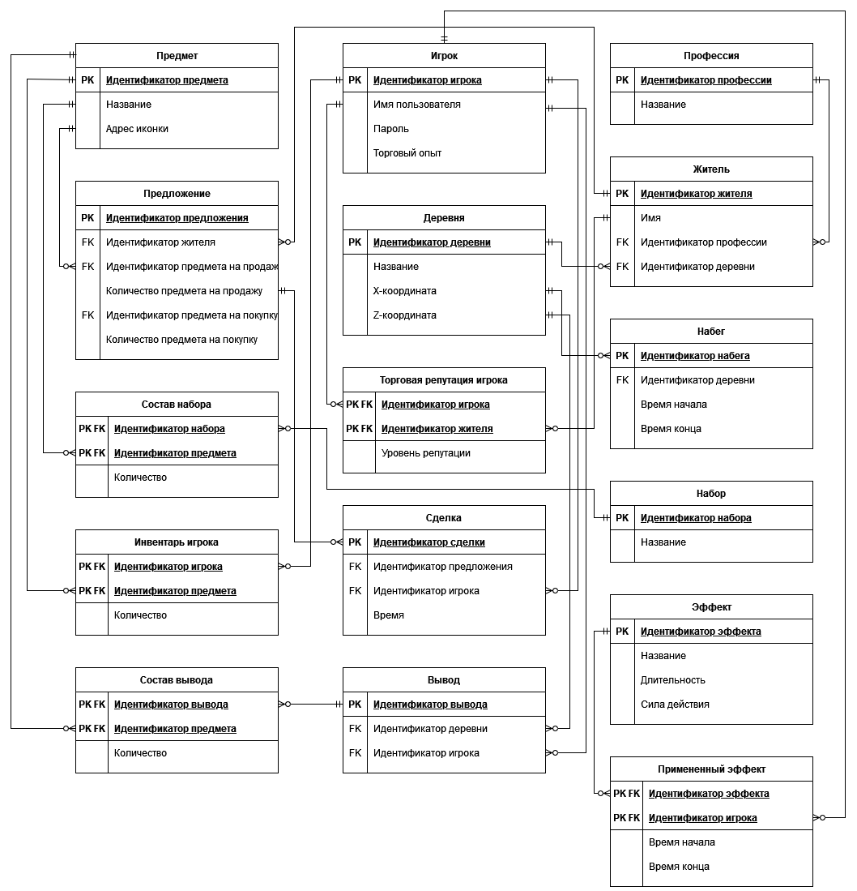
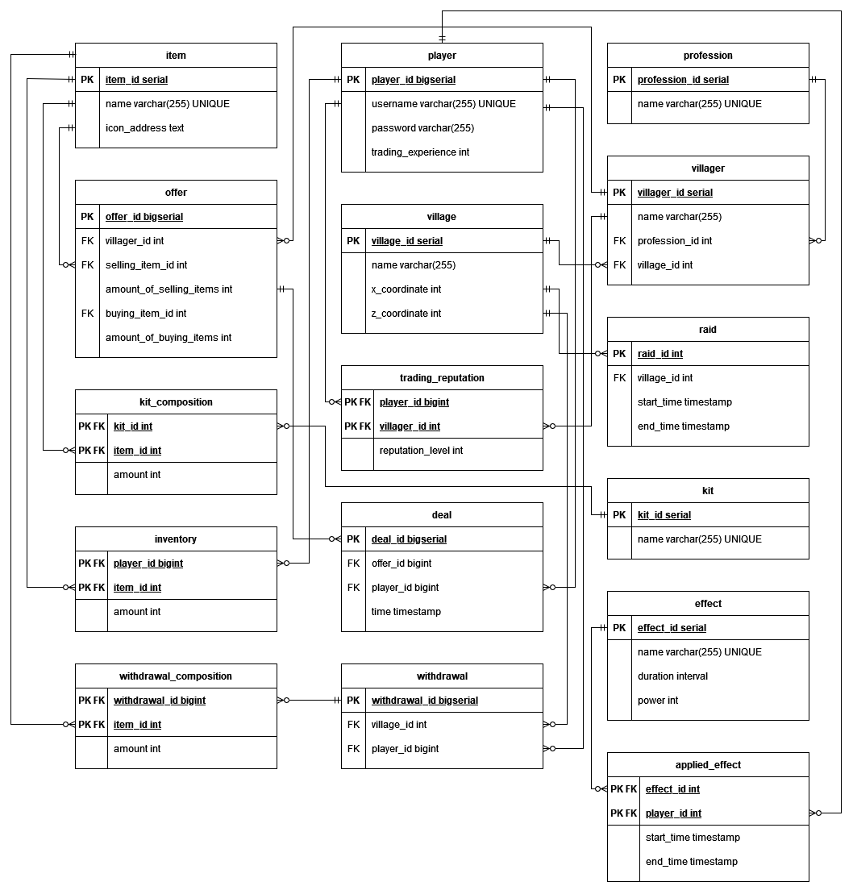

# Информационные системы и базы данных

Бэкенд для [Village Carrier](https://github.com/slamach/village-carrier). Веб-версия торговли с жителями из майнкрафта.

Приложение создано с использованием:

* Spring Boot
* JUnit
* Mockito
* OpenAPI
* Liquibase
* PostgreSQL
* Docker

## Функции

* Просмотр деревень.
* Просмотр жителей.
* Просмотр предложений жителей и их фильтрация.
* Просмотр совершенных сделок.
* Получение наборов. Например, kit starter.
* Рейды. Получение скидки в случае успешного отбивания рейда.
* Просмотр инвентаря.
* Вывод предметов.

## Инфологическая модель



## Даталогическая модель



## Сборка и запуск

PostgreSQL должна быть установлена. Необходимо наличие SSL-сертификата, путь до него записать в системную переменную
key_store. Необходимо задать следующие системные переменные: db_host, db_username, db_password, liquibaseProKey,
key_store, key_store_password.

Синхронизация сущностей и процедур базы данных:

```
./gradlew update
```

Сборка и запуск приложения:

```
./gradlew bootRun
```

Проверка работоспособности:

```
curl "https://<your-domain-name>:8443/api/v1/offers"
```

## Запуск с помощью Docker

```
docker build -t isbd:latest .
docker-compose up -d
```